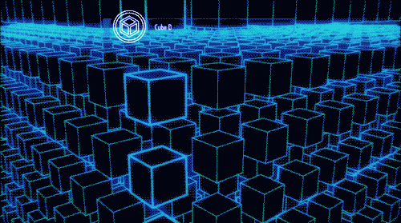

## Buenas 👋

Hola! Mi nombre es Francisco Manuel Redondo Jiménez y soy desarrollador WEB. Me apasiona todo lo relacionado con la tecnología, sobre todo todo la creación de sitios web.  
🎓 Entre mis estudios se encuentra Tecnico en Sistemas Microinformaticos y Redes y tecnico superior en desarrollo de aplicaciones web   
🔭 Actualmente estoy trabajando, en el desarrollo de una plataforma dedicada, realizada con Laravel, Jquery, Ajax, Tailwind, etc   
🌱 En estos momentos me estoy centrando en mejoras las tecnologias que uso para la creación del backend del sitio web.   
👯 Me gustaría colaborar en un proyecto con un equipo de desarrollo en el que puedas intercambiar actitides y tecnologias.   
🤔 Estoy buscando ayuda para poder conocer todas las posibilidades del desarrollo y tenerlas en cuenta para cualquier proyecto   
💬 Puedes preguntarme cualquier cosa relacionada con la tecnologia y el desarrollo web, que si tengo la respuesta te la daré   
📫 Puedes contastarme a traves de mi sitio web fmredondo.com o desde el correo de info@fmredondo.com   
⚡ Lo que mas me divierte es segun formandome y aprender a desarrollar todo lo que se me pase por la mente!   

<!--
**FMRedondo/FMRedondo** is a ✨ _special_ ✨ repository because its `README.md` (this file) appears on your GitHub profile.
