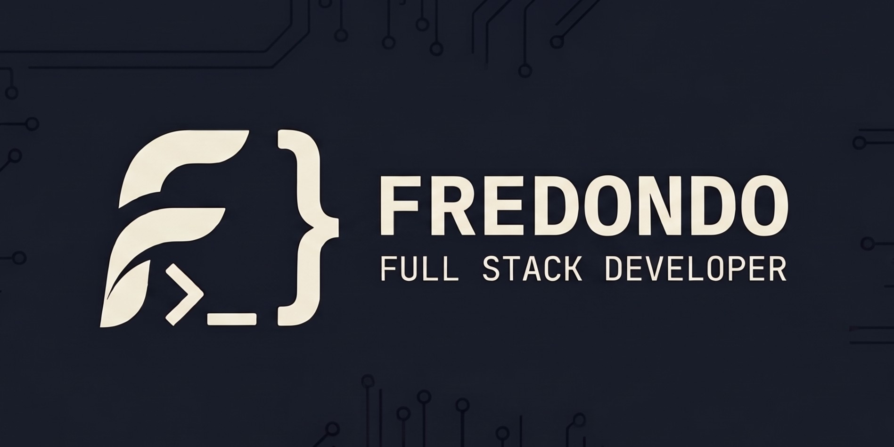

<div align="center">

  

  <br />
  <br />

  <a href="https://fredondo.dev">
    
  </a>
  <a href="https://www.linkedin.com/in/fmredondo/">
    
  </a>
  <a href="mailto:fredondodev@gmail.com">
    
  </a>

</div>

<br />

<table width="100%">
<tr>
<td>

```bash
# 🔴 🟡 🟢  fredondo@dev-environment:~

❯ whoami
Francisco Manuel Redondo Jiménez (FREDONDO)

❯ cat profile.json
{
  "role": "Full Stack Engineer",
  "stack": ["Web", "Mobile", "Cloud & DevOps"],
  "status": "Building digital products"
}

❯ open portfolio
🚀 Live at [https://fredondo.dev](https://fredondo.dev)